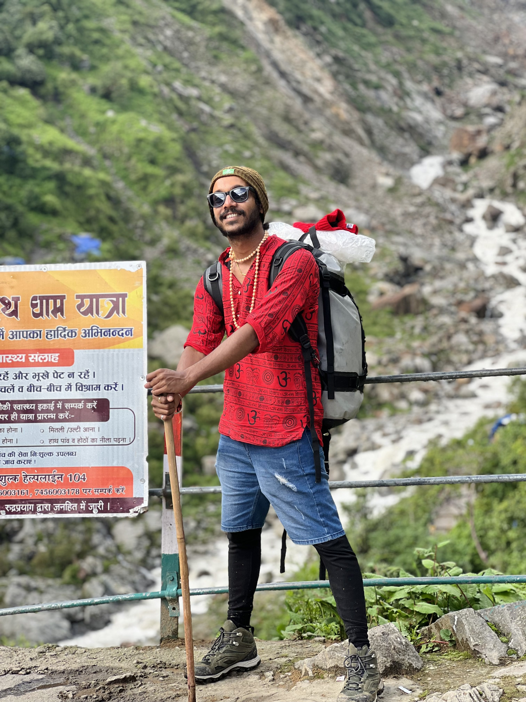
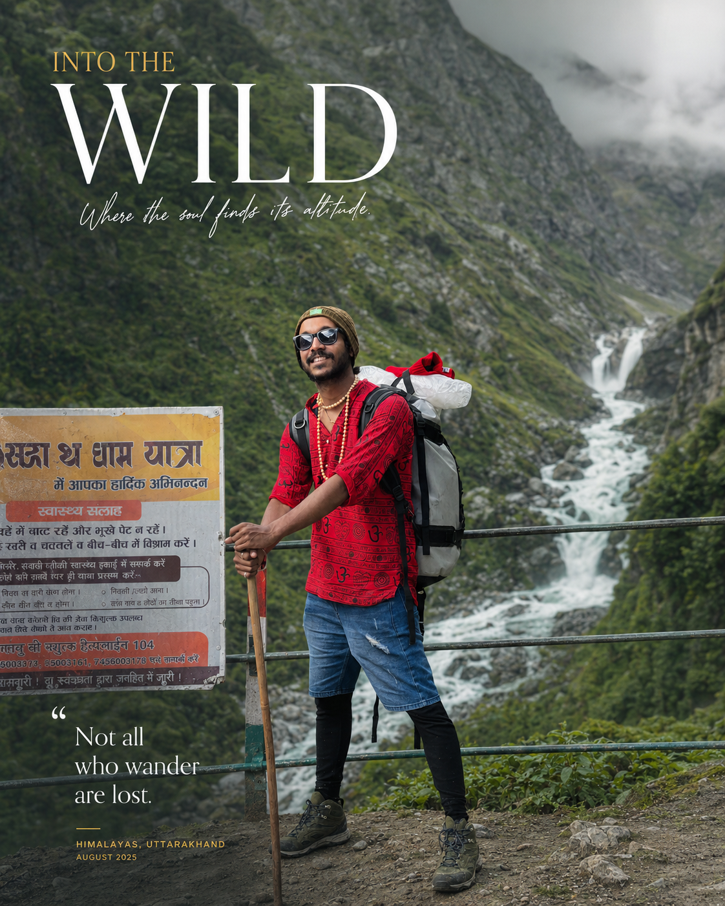

# 🌍 Ultra-Realistic Cinematic Travel Editorial Poster

## Prompt

Use the uploaded image as the exact reference for the person.

Preserve the person's identity with absolute accuracy, including facial features, skin tone, hairstyle, facial hair, expression, body proportions, clothing, accessories, pose, framing, camera angle, and natural perspective. The person must remain completely recognizable and unchanged.

Create a breathtaking travel scene where the person appears to have been genuinely photographed on location by a professional travel photographer. The final result must feel like an authentic outdoor photograph captured during a real journey rather than an edited or composited image.

Build a spectacular natural environment that perfectly complements the subject and original perspective. Depending on the composition, create an awe-inspiring luxury travel destination featuring majestic mist-covered mountains, lush evergreen forests, towering waterfalls, crystal-clear rivers, dramatic cliffs, alpine landscapes, rolling valleys, dense morning fog, floating clouds, and subtle atmospheric haze.

Ensure the environment blends seamlessly with the subject by matching:

- Natural lighting direction
- Shadow intensity
- Perspective and camera height
- Lens compression
- Atmospheric depth
- Ground contact
- Ambient reflections
- Environmental color bounce

The lighting should behave exactly as it would in a real outdoor location.

Allow soft morning sunlight or golden-hour light to naturally filter through the landscape, producing realistic volumetric light rays, gentle highlights, and physically accurate shadows.

Maintain completely authentic skin tones under natural outdoor lighting.

Preserve realistic skin texture, pores, natural imperfections, hair details, fabric texture, and clothing folds. Avoid beauty filters, artificial skin smoothing, HDR halos, excessive sharpening, or unrealistic saturation.

Create realistic interaction between the subject and the environment by naturally integrating subtle reflected light from surrounding vegetation, mountains, rocks, water, and atmospheric mist.

The composition should resemble a premium travel campaign photographed using a professional full-frame DSLR or medium-format camera with cinematic optics.

Use:

- Full-frame DSLR
- 50mm or 85mm prime lens
- Natural depth of field
- High dynamic range
- Physically accurate lighting
- Premium editorial composition
- Ultra-sharp subject
- Soft optical background separation

The final image should be indistinguishable from a genuine luxury travel photograph.

---

## Premium Editorial Typography

Automatically design a luxury magazine-style editorial layout that complements the composition without overwhelming the photograph.

Generate completely unique text based on the location, atmosphere, weather, colors, and mood of the scene.

Include:

• One powerful cinematic headline
• One elegant handwritten or script accent text
• One short inspirational travel quote
• Minimal editorial details
• Clean luxury layout
• Professional magazine composition
• Modern typography hierarchy

Typography should:

- Never cover the face
- Never block important body features
- Never hide key scenery
- Follow natural negative space
- Use elegant white typography
- Add subtle gold accents only when appropriate
- Blend naturally into the composition

The design should resemble an official luxury travel campaign created for National Geographic Traveller, Condé Nast Traveller, or a premium tourism brand.

---

## Negative Prompt

Do NOT generate:

- AI-generated appearance
- Composite or cut-out look
- Background replacement artifacts
- Halo around the subject
- Plastic skin
- Beauty filters
- Overprocessed HDR
- Oversharpening
- Unrealistic skin tones
- Cartoon
- Anime
- Painting
- CGI
- Unrealistic fog
- Fake mountains
- Incorrect shadows
- Floating subject
- Distorted anatomy
- Blurred face
- Low resolution
- Watermarks
- Logos
- Text overlapping the face
- Poor typography alignment
- Duplicate people
- Extra limbs
- Unrealistic perspective
- Color banding
- Compression artifacts

---

## Recommended Settings

| Setting | Value |
|---------|--------|
| Style | Photorealistic |
| Quality | Ultra High |
| Resolution | 4K–8K |
| Camera | Full-frame DSLR |
| Lens | 50mm / 85mm Prime |
| Lighting | Natural Outdoor |
| Depth of Field | Optical |
| Aspect Ratio | 4:5 |
| Dynamic Range | HDR |

---

## Best For

- Luxury Travel Posters
- Instagram Editorial Posts
- Adventure Photography
- Travel Campaigns
- Tourism Branding
- Magazine Covers
- Destination Promotions
- Premium Portfolio Photography

---

## Goal

Create a visually stunning, ultra-realistic luxury travel editorial poster that looks like it was genuinely photographed on location by a world-class travel photographer. The final result should be indistinguishable from a real National Geographic or luxury fashion travel campaign, with perfectly integrated environmental lighting, authentic skin tones, premium typography, and cinematic realism.

## 🖼️ Example

**Before**

**After**

---

## 🏷️ Tags

`forest` `fog` `background` `cinematic` `portrait` `photorealistic` `nature` `green` `editorial`

---

## 📌 Notes

This prompt is designed for AI image editing models that support background replacement while preserving the original subject. It produces the best results with high-resolution portrait photos taken in natural lighting.
